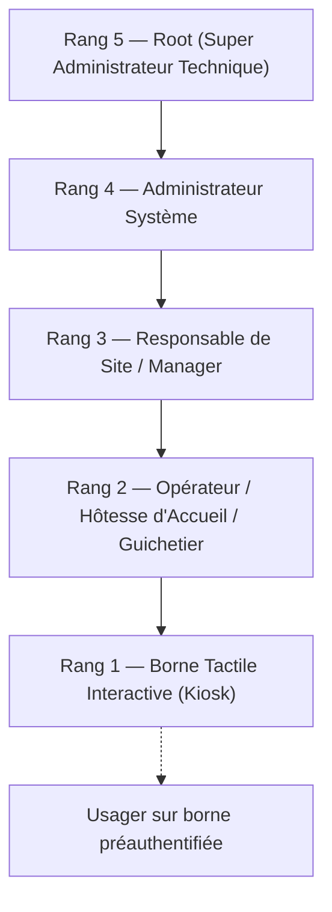
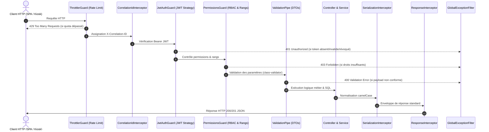
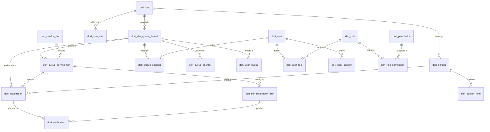
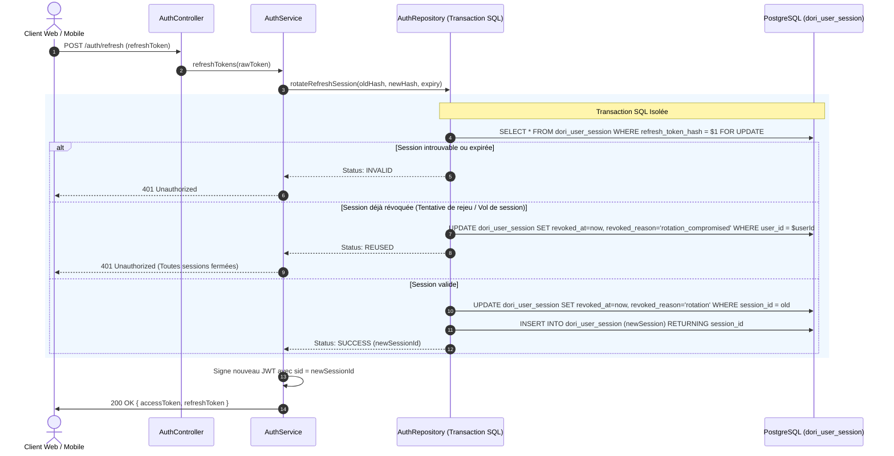
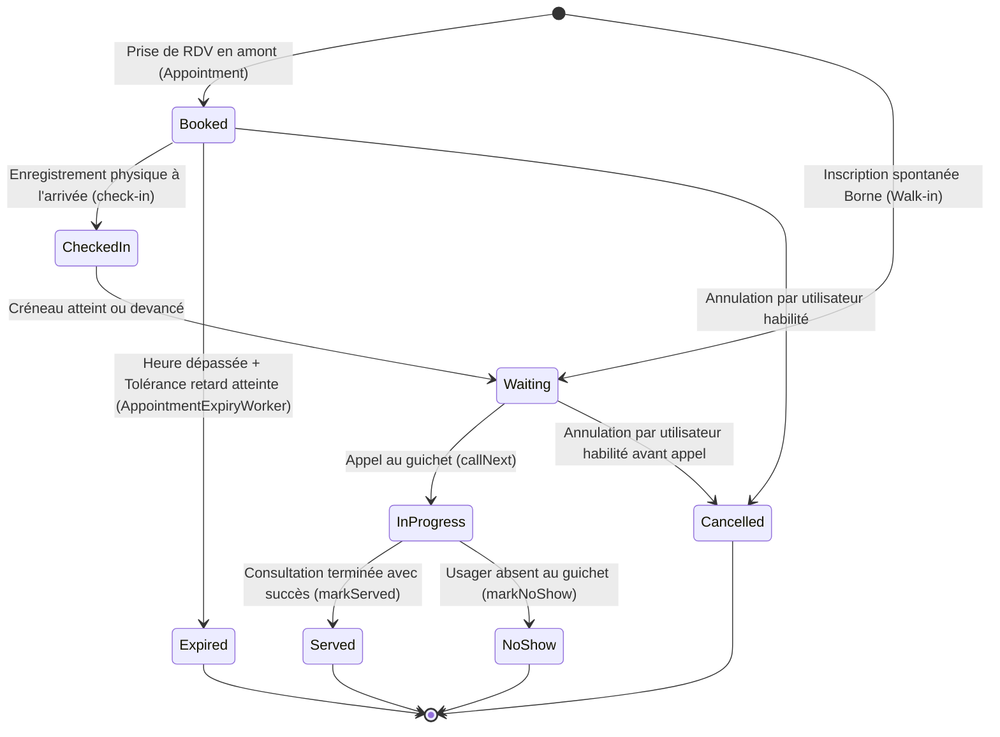
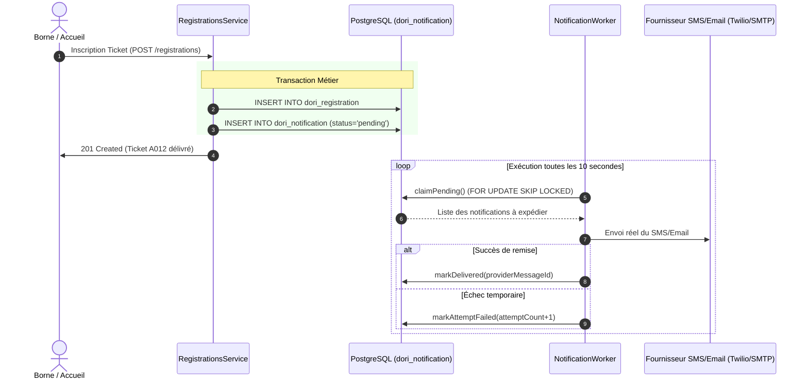

# Spécification Fonctionnelle & Technique Détaillée (SFD) — DORI-API

> **Application** : DORI API (Système de Gestion Intelligente des Files d'Attente et de l'Accueil)  
> **Auteur** : Rétro-spécification technique exhaustive basée sur l'audit complet du code source (`src/`)  
> **Date de référence** : Octobre 2026  
> **Version** : 1.2.0 finale vérifiée  
> **Emplacement du document** : `/ai/sfd.md`

---

## Sommaire

1. [Introduction & Périmètre du Système](#1-introduction--périmètre-du-système)
   - 1.1 [Contexte & Mission](#11-contexte--mission)
   - 1.2 [Glossaire & Vocabulaire Métier](#12-glossaire--vocabulaire-métier)
   - 1.3 [Typologie des Acteurs & Utilisateurs](#13-typologie-des-acteurs--utilisateurs)
2. [Architecture Technique & Principes Directeurs](#2-architecture-technique--principes-directeurs)
   - 2.1 [Stack Technique & Dépendances Clés](#21-stack-technique--dépendances-clés)
   - 2.2 [Principes Fondamentaux de Conception](#22-principes-fondamentaux-de-conception)
   - 2.3 [Organisation du Code Source](#23-organisation-du-code-source)
   - 2.4 [Pipeline de Traitement des Requêtes (Middlewares, Guards, Interceptors, Filters)](#24-pipeline-de-traitement-des-requêtes)
3. [Modèle de Données & Persistance Relationnelle (PostgreSQL)](#3-modèle-de-données--persistance-relationnelle-postgresql)
   - 3.1 [Diagramme Entité-Association Global (ERD)](#31-diagramme-entité-association-global-erd)
   - 3.2 [Dictionnaire des Tables & Contraintes](#32-dictionnaire-des-tables--contraintes)
   - 3.3 [Règles d'Intégrité Territoriale & Multi-Sites](#33-règles-dintégrité-territoriale--multi-sites)
   - 3.4 [Indexation & Optimisations de Concurrence](#34-indexation--optimisations-de-concurrence)
4. [Sécurité, Authentification & Autorisation (RBAC)](#4-sécurité-authentification--autorisation-rbac)
   - 4.1 [Gestion des Identités & Authentification (JWT + Refresh Session)](#41-gestion-des-identités--authentification-jwt--refresh-session)
   - 4.2 [Cycle de Vie des Sessions & Rotation Atomique Anti-Rejeu](#42-cycle-de-vie-des-sessions--rotation-atomique-anti-rejeu)
   - 4.3 [Modèle RBAC & Contrôle Hiérarchique Anti-Escalade](#43-modèle-rbac--contrôle-hiérarchique-anti-escalade)
   - 4.4 [Cloisonnement Territorial des Données (Scope Service)](#44-cloisonnement-territorial-des-données-scope-service)
   - 4.5 [Sécurité des Webhooks Entrants (Signature HMAC & Tolérance Temporelle)](#45-sécurité-des-webhooks-entrants)
5. [Moteur de File d'Attente (Queue Engine)](#5-moteur-de-file-dattente-queue-engine)
   - 5.1 [Cycle de Vie d'un Ticket / Inscription (State Machine)](#51-cycle-de-vie-dun-ticket--inscription-state-machine)
   - 5.2 [Guichets, Postes & Sessions Opérateurs](#52-guichets-postes--sessions-opérateurs)
   - 5.3 [Algorithme d'Ordonnancement & Calcul du Score de Priorité](#53-algorithme-dordonnancement--calcul-du-score-de-priorité)
   - 5.4 [Concurrence & Appel du Prochain Client (`callNext`)](#54-concurrence--appel-du-prochain-client-callnext)
   - 5.5 [Traitement et Clôture (`served`, `no-show`)](#55-traitement-et-clôture-served-no-show)
6. [Diffusion Événementielle & Temps Réel (WebSockets)](#6-diffusion-événementielle--temps-réel-websockets)
   - 6.1 [Architecture de la Passerelle (`RealtimeGateway`)](#61-architecture-de-la-passerelle-realtimegateway)
   - 6.2 [Salles Virtuelles (Rooms) & Politiques d'Anonymisation](#62-salles-virtuelles-rooms--politiques-danonymisation)
   - 6.3 [Catalogue des Événements Émis](#63-catalogue-des-événements-émis)
7. [Système de Notifications & Modèle Transactionnel Outbox](#7-système-de-notifications--modèle-transactionnel-outbox)
   - 7.1 [Règles de Notification par Forfait & File](#71-règles-de-notification-par-forfait--file)
   - 7.2 [Cycle de Vie d'une Notification (Outbox Pattern)](#72-cycle-de-vie-dune-notification-outbox-pattern)
   - 7.3 [Dépilement Concurrente Distribué (`NotificationWorker`)](#73-dépilement-concurrente-distribué-notificationworker)
8. [Tâches Périodiques & Traitements d'Arrière-Plan (Workers)](#8-tâches-périodiques--traitements-darrière-plan-workers)
   - 8.1 [Réinitialisation Quotidienne (`DailyResetWorker`)](#81-réinitialisation-quotidienne-dailyresetworker)
   - 8.2 [Expiration des Rendez-vous Dépassés (`AppointmentExpiryWorker`)](#82-expiration-des-rendez-vous-dépassés-appointmentexpiryworker)
9. [Internationalisation (i18n) & Gestion Dynamique des Contenus](#9-internationalisation-i18n--gestion-dynamique-des-contenus)
   - 9.1 [Architecture du Référentiel de Traduction](#91-architecture-du-référentiel-de-traduction)
   - 9.2 [Validation des Variables & Invalidation de Cache](#92-validation-des-variables--invalidation-de-cache)
10. [Cartographie Exhaustive des Endpoints API](#10-cartographie-exhaustive-des-endpoints-api)
11. [Rapports, Métriques & Tableaux de Bord](#11-rapports-métriques--tableaux-de-bord)
12. [Dette Technique Identifiée & Points d'Attention Opérationnels](#12-dette-technique-identifiée--points-dattention-opérationnels)
13. [Couverture Produit & Écarts pour les Clients Front-End](#13-couverture-produit--écarts-pour-les-clients-front-end)

---

## 1. Introduction & Périmètre du Système

### 1.1 Contexte & Mission
**DORI-API** est le système dorsal (backend) centralisé d'une plateforme de gestion de parcours usagers et de régulation de files d'attente destiné aux établissements recevant du public à flux tendu (centres hospitaliers, cliniques, administrations, centres de services).

Le système gère l'intégralité du cycle de vie de l'accueil physique :
- La prise de rendez-vous en amont ou l'accueil spontané sur borne tactile (*kiosk* / *walk-in*).
- La génération et l'ordonnancement dynamique des tickets de passage selon des critères d'urgence, de forfait souscrit (service tiers) et d'équité temporelle.
- L'orientation des usagers vers des guichets physiques ou virtuels animés par des opérateurs (hôtesses, médecins, agents administratifs).
- L'information en temps réel des usagers via écrans d'affichage dynamique, notifications SMS/email et lien de suivi web personnalisé.
- Le suivi statistique et le reporting d'affluence et de performance opérationnelle.

### 1.2 Glossaire & Vocabulaire Métier

| Terme | Définition Métier | Entité Système Associée |
| :--- | :--- | :--- |
| **Site** | Établissement physique autonome (ex. Hôpital Habib Bourguiba) possédant son propre fuseau horaire, devise et paramètres par défaut. | `dori_site` |
| **Queue (File)** | File d'attente thématique attachée à un site (ex. "Consultation Pédiatrie", "Guichet Facturation"). | `dori_site_queue_thread` |
| **Thread (Guichet / Ligne)** | Canal physique ou logique d'appel au sein d'une file (ex. Guichet 1, Guichet 2). | `thread_number` dans `dori_queue_session` |
| **Session d'Opérateur** | Connexion active d'un utilisateur sur une file d'attente donnée, lui attribuant un guichet (`thread_number`) pour appeler des usagers. | `dori_queue_session` |
| **Person (Usager/Patient)** | Fiche identitaire d'une personne physique (nom, prénom, téléphone normalisé E.164, email). Rattachée obligatoirement à un site. | `dori_person` |
| **Service Tier (Forfait)** | Catégorie de service déterminant la tarification, la priorité d'appel et les politiques de notification (ex. Standard, VIP, Urgence). | `dori_service_tier` |
| **Queue Service Tier** | Association d'un forfait à une file donnée avec surcharge éventuelle du prix, de la devise et du forfait par défaut. | `dori_queue_service_tier` |
| **Registration (Inscription / Ticket)** | Entité centrale représentant un passage d'usager pour une journée métier donnée. Associée à un numéro de ticket (ex. `A042`). | `dori_registration` |
| **Appointment (Rendez-vous)** | Inscription planifiée à une heure précise (`scheduled_time`), nécessitant un enregistrement préalable (`check-in`) avant appel. | `dori_registration` (`entry_type = 'appointment'`) |
| **Walk-in** | Inscription spontanée sans rendez-vous prise le jour même (sur borne ou guichet). | `dori_registration` (`entry_type = 'walkin'`) |
| **Tracking Token** | Identifiant opaque (UUID v4) permettant à un usager de suivre anonymement sa position en file d'attente sans compte applicatif. | `registration_tracking_token` |
| **Daily Reset** | Procédure automatisée nocturne remettant à zéro les compteurs journaliers et clôturant/reportant les tickets ouverts. | `dori_queue_daily_reset` |

### 1.3 Typologie des Acteurs & Utilisateurs

Le système applique un contrôle d'accès fondé sur les rôles (RBAC) étanche structuré selon 5 échelons de rang :



- **Rang 5 — Root (`root`)** : Super-utilisateur de maintenance globale, accès total sans restriction de périmètre de site.
- **Rang 4 — Admin (`admin`)** : Administration générale, paramétrage des rôles, gestion des sites et supervision globale.
- **Rang 3 — Manager (`manager`)** : Gestion locale d'un ou plusieurs sites affectés, supervision des files, assignation des opérateurs, extraction des rapports.
- **Rang 2 — Hostess / Opérateur (`hostess`, `operator`)** : Prise en charge des guichets, ouverture de session, appel des prochains tickets (`callNext`), validation des présences et clôtures.
- **Rang 1 — Kiosk (`kiosk`)** : Compte technique de borne en libre-service, restreint à l'émission de tickets, recherche d'usagers et check-in.
- **Usager / Public** : Client anonyme consultant son statut via `registration_tracking_token` ou écrans d'affichage passifs via le canal WebSocket dédié.

---

## 2. Architecture Technique & Principes Directeurs

### 2.1 Stack Technique & Dépendances Clés

| Composant | Technologie retenue | Justification & Rôle |
| :--- | :--- | :--- |
| **Runtime** | Node.js 22.x LTS | Moteur d'exécution JavaScript serveur moderne, support natif CommonJS et ESM. |
| **Framework Web** | NestJS 10.x | Architecture modulaire basée sur l'inversion de contrôle (IoC) et l'injection de dépendances. |
| **Langage** | TypeScript 5.x | Typage statique strict (`strict: true`), absence d'incohérences de contrat. |
| **Base de Données** | PostgreSQL 15+ | Moteur relationnel robuste garantissant l'atomicité ACID, les verrous fins et le support JSON/UUID. |
| **Accès aux Données** | SQL Natif via `DataSource.query` | Évitement délibéré des abstractions ORM lourdes au profit d'un contrôle total des verrous de concurrence (`FOR UPDATE`, `SKIP LOCKED`). |
| **Sécurité & Hash** | `bcryptjs` (12 rounds) | Hachage sécurisé des mots de passe utilisateurs, avec coût centralisé dans `security.bcryptRounds`. |
| **Jetons d'Accès** | `@nestjs/jwt`, `jsonwebtoken` | Signatures cryptographiques HMAC-SHA256 avec validation stricte du secret (>= 32 caractères). |
| **Temps Réel** | `@nestjs/websockets` / Socket.IO | Passerelle WebSocket pour notifications instantanées aux bornes, guichets et écrans. |
| **Planification** | `@nestjs/schedule` | Ordonnancement des crons et workers d'arrière-plan. |
| **Dates & Fuseaux** | `date-fns`, `date-fns-tz` | Manipulation déterministe des dates avec respect strict des fuseaux horaires locaux (`Africa/Tunis`, etc.). |
| **Validation DTO** | `class-validator`, `class-transformer` | Validation fail-fast des charges utiles entrantes selon des règles déclaratives strictes. |
| **Documentation API** | `@nestjs/swagger`, OpenAPI 3.0 | Spécification vivante du contrat d'interface REST. |

### 2.2 Principes Fondamentaux de Conception

1. **Persistance en SQL Natif Paramétré Strict** :  
   Tous les repositories exploitent le `DataSource` de TypeORM uniquement comme pilote d'exécution de requêtes SQL écrites à la main. Cela prévient les problèmes de requêtes N+1 imprévisibles et permet l'exploitation directe des clauses de verrouillage transactionnel de PostgreSQL.
2. **Centralisation Stricte de l'Environnement (`ConfigService`)** :  
   Aucun appel direct à `process.env` n'est autorisé hors de `src/core/config/configuration.ts`. Contrôleurs, services et bootstrap consomment exclusivement `ConfigService`; les variables sont normalisées et validées au démarrage.
3. **Temps Déterministe et Injecté (`ClockService`)** :  
   Les décisions temporelles métier s'appuient sur `ClockService.now()` afin de rester testables. Les timestamps purement techniques et transactionnels peuvent rester produits par PostgreSQL lorsqu'ils doivent partager exactement l'horloge et la transaction de la base.
4. **Sérialisation & Normalisation CamelCase Universelle** :  
   Toutes les réponses de l'API sont normalisées en format camelCase via l'intercepteur `SerializationInterceptor`, garantissant un contrat unifié vis-à-vis des interfaces graphiques clientes (web et mobiles).
5. **Enveloppe d'Erreur Standardisée** :  
   Toute exception non interceptée ou levée via `DoriException` produit une structure JSON homogène contenant `code`, `translationKey`, `translationParams` et `data`.

### 2.3 Organisation du Code Source

```
src/
├── core/                           # Fondations transverses de l'application
│   ├── auth/                       # Stratégies JWT, interfaces de session, guards
│   ├── clock/                      # Service central de gestion du temps et fuseaux
│   ├── config/                     # Définition et validation fail-fast de la configuration
│   ├── database/                   # Bootstrap TypeORM, migration et scripts de seed
│   ├── errors/                     # Catalogue d'exceptions métier et filtre global
│   ├── health/                     # Endpoint de sonde de vitalité (/api/v1/health)
│   ├── http/                       # Intercepteur de corrélation (Correlation-ID)
│   ├── pagination/                 # DTOs et utilitaires de pagination universelle
│   ├── rbac/                       # Décorateurs, guards et résolution des permissions/scopes
│   ├── realtime/                   # Gateway WebSocket et service de diffusion par room
│   ├── response/                   # Intercepteur d'enveloppe de réponse API
│   ├── serialization/              # Transformation snake_case -> camelCase
│   ├── swagger/                    # Décorateurs Swagger centralisés (@ApiDoriResponse)
│   └── validation/                 # Pipe de validation global class-validator
├── modules/                        # Modules fonctionnels métier (12 modules)
│   ├── auth/                       # Authentification, refresh token atomique, logout
│   ├── notifications/              # Règles et outbox de notifications, webhooks entrants
│   ├── persons/                    # Répertoire des usagers et notes associées
│   ├── queue-engine/               # Moteur d'appel de file, sessions opérateurs et guichets
│   ├── queues/                     # Configuration des files, quotas et affectations
│   ├── rbac/                       # Gestion des rôles et matrice des permissions
│   ├── registrations/              # Inscriptions, génération de tickets, disponibilité créneaux
│   ├── reports/                    # Métriques statistiques et affluence
│   ├── service-tiers/              # Paliers de service (forfaits) et règles d'alerte
│   ├── sites/                      # Gestion des sites physiques et managers
│   ├── translations/               # Internationalisation dynamique (IHM, SMS, Erreurs)
│   └── users/                      # Annuaire des comptes utilisateurs et anti-escalade
├── workers/                        # Tâches d'arrière-plan planifiées
│   ├── appointment-expiry/         # Clôture des RDV non honorés
│   ├── daily-reset/                # Reset nocturne des compteurs par fuseau horaire
│   └── notification-worker/        # Dépileur transactionnel de notifications (SMS/Email)
├── app.module.ts                   # Module racine NestJS assemblant l'ensemble
└── main.ts                         # Point d'entrée de bootstrap de l'application
```

### 2.4 Pipeline de Traitement des Requêtes

Chaque requête HTTP adressée à DORI-API traverse une succession de couches coordonnées :



---

## 3. Modèle de Données & Persistance Relationnelle (PostgreSQL)

### 3.1 Diagramme Entité-Association Global (ERD)



### 3.2 Dictionnaire des Tables & Contraintes

#### 1. `dori_site` — Établissements & Paramètres Globaux
| Colonne | Type | Nullable | Valeur par défaut | Description & Contraintes |
| :--- | :--- | :--- | :--- | :--- |
| `site_id` | SERIAL | Non | Auto-incrément | Clé primaire |
| `site_name` | VARCHAR(255) | Non | - | Nom usuel de l'établissement |
| `site_location` | VARCHAR(255) | Oui | NULL | Adresse physique ou libellé du site |
| `site_logo_url` | TEXT | Oui | NULL | URL du visuel du site |
| `site_type` | VARCHAR(50) | Non | `'public'` | Type d'établissement (`'public'`, `'private'`) |
| `timezone` | VARCHAR(64) | Non | `'Africa/Tunis'` | Fuseau horaire IANA officiel |
| `default_currency` | CHAR(3) | Non | `'TND'` | Code devise ISO-4217 par défaut |
| `is_active` | BOOLEAN | Non | `TRUE` | État d'activation du site |
| `deleted_at` | TIMESTAMPTZ | Oui | NULL | Date de suppression logique (*soft delete*) |
| `default_appointments_enabled` | BOOLEAN | Non | `FALSE` | Prise de RDV autorisée par défaut sur les files |
| `default_appointment_slot_duration` | INT | Non | `15` | Durée unitaire d'un créneau en minutes |
| `default_slot_capacity` | INT | Non | `1` | Nombre maximal de RDV par créneau |
| `default_working_hours_start` | TIME | Non | `'08:00'` | Heure d'ouverture par défaut |
| `default_working_hours_end` | TIME | Non | `'17:00'` | Heure de fermeture par défaut |
| `default_late_tolerance_minutes` | INT | Non | `60` | Tolérance de retard avant expiration du RDV |
| `default_base_weight_walkin` | NUMERIC(10,2) | Non | `0` | Poids initial du ticket spontané dans le score |
| `default_base_weight_appointment` | NUMERIC(10,2) | Non | `60` | Poids initial du ticket RDV dans le score |
| `default_escalation_rate_walkin` | NUMERIC(10,2) | Non | `1` | Taux de montée en priorité par minute d'attente (walkin) |
| `default_escalation_rate_appointment` | NUMERIC(10,2) | Non | `1` | Taux de montée en priorité par minute d'attente (RDV) |
| `default_carry_over_waiting` | BOOLEAN | Non | `FALSE` | Reporter les tickets non traités au lendemain lors du reset |
| `default_daily_reset_mode` | VARCHAR(20) | Non | `'close_all'` | Mode de reset (`'close_all'`, `'close_served_only'`) |
| `default_daily_reset_time` | TIME | Non | `'03:00'` | Heure locale d'exécution du reset nocturne |
| `default_locale` | VARCHAR(10) | Non | `'fr'` | Langue IHM par défaut du site |

#### 2. `dori_site_queue_thread` — Files d'Attente
| Colonne | Type | Nullable | Valeur par défaut | Description & Contraintes |
| :--- | :--- | :--- | :--- | :--- |
| `queue_id` | SERIAL | Non | Auto-incrément | Clé primaire |
| `queue_code` | VARCHAR(10) | Non | - | Préfixe du ticket (ex. `'A'`, `'PED'`). Unique par site. |
| `site_id` | INT | Non | - | Référence `dori_site(site_id)` |
| `queue_name` | VARCHAR(50) | Oui | NULL | Libellé de la file |
| `is_active` | BOOLEAN | Non | `TRUE` | État d'activation |
| `average_wait_time` | INT | Non | `10` | Temps d'attente moyen estimé par usager (minutes) |
| `thread_count` | INT | Non | `1` | Nombre maximal de guichets simultanés (`>= 1`) |
| `currency` | CHAR(3) | Oui | NULL | Surcharge de devise (hérite du site si NULL) |
| *surcharges de file* | Divers | Oui | NULL | Surcharge optionnelle de tous les paramètres par défaut du site |

#### 3. `dori_person` — Usagers & Patients
| Colonne | Type | Nullable | Description & Contraintes |
| :--- | :--- | :--- | :--- |
| `person_id` | SERIAL | Non | Clé primaire |
| `site_id` | INT | Non | Référence `dori_site(site_id)` (intégrité territoriale obligatoire) |
| `first_name` | VARCHAR(50) | Oui | Prénom de l'usager |
| `last_name` | VARCHAR(50) | Non | Nom de famille (ne peut être vide : `BTRIM(last_name) <> ''`) |
| `email` | VARCHAR(255) | Oui | Adresse électronique |
| `phone_number` | VARCHAR(20) | Non | Téléphone normalisé international E.164 (`^\+[1-9][0-9]{6,14}$`) |
| `birth_date` | DATE | Oui | Date de naissance |
| `language_preference` | VARCHAR(10) | Non | Langue préférée pour les échanges (`'fr'`, `'ar'`, etc.) |

#### 4. `dori_registration` — Inscriptions & Tickets
| Colonne | Type | Nullable | Description & Contraintes |
| :--- | :--- | :--- | :--- |
| `registration_id` | SERIAL | Non | Clé primaire |
| `person_id` | INT | Non | Référence `dori_person(person_id)` |
| `queue_id` | INT | Non | Référence `dori_site_queue_thread(queue_id)` |
| `tier_id` | INT | Non | Forfait souscrit (`dori_queue_service_tier(queue_id, tier_id)`) |
| `business_date` | DATE | Non | Date métier de validité du passage |
| `ticket_number` | VARCHAR(14) | Non | Numéro affiché (ex. `'A001'`). Unique par `(queue_id, business_date, ticket_number)`. |
| `entry_type` | VARCHAR(20) | Non | `'walkin'` ou `'appointment'` |
| `scheduled_time` | TIMESTAMPTZ | Oui | Heure planifiée du RDV (obligatoire si `'appointment'`) |
| `checked_in_at` | TIMESTAMPTZ | Oui | Heure d'enregistrement physique sur borne ou accueil |
| `appointment_status` | VARCHAR(20) | Non | Statut RDV (`'n/a'`, `'booked'`, `'checked_in'`, `'rescheduled'`, `'cancelled'`, `'expired'`) |
| `priority_reference_time` | TIMESTAMPTZ | Non | Horodatage servant de base au calcul de l'ancienneté d'attente |
| `status` | VARCHAR(20) | Non | Statut file (`'booked'`, `'waiting'`, `'in_progress'`, `'served'`, `'no_show'`, `'expired'`, `'cancelled'`) |
| `current_session_id` | INT | Oui | Référence session opérateur en cours (`dori_queue_session`) |
| `called_at` | TIMESTAMPTZ | Oui | Horodatage de l'appel au guichet |
| `served_at` | TIMESTAMPTZ | Oui | Horodatage du début/fin de prise en charge effective |
| `closed_at` | TIMESTAMPTZ | Oui | Horodatage de clôture définitive |
| `registration_tracking_token` | UUID | Non | Token secret opaque généré (`gen_random_uuid()`) pour consultation usager |
| `registration_tracking_token_valid_until`| TIMESTAMPTZ | Non | Expiration du token de consultation |

#### 5. `dori_queue_session` — Postes d'Opérateurs Actifs
| Colonne | Type | Nullable | Description & Contraintes |
| :--- | :--- | :--- | :--- |
| `session_id` | SERIAL | Non | Clé primaire |
| `queue_id` | INT | Non | File opérée |
| `user_id` | INT | Non | Utilisateur opérateur connecté |
| `thread_number` | INT | Oui | Numéro de guichet physique (requis si mode `'active'`, NULL si `'consultation_only'`) |
| `mode` | VARCHAR(20) | Non | `'active'` (appelle des tickets) ou `'consultation_only'` (supervision passive) |
| `connected_at` | TIMESTAMPTZ | Non | Début de session |
| `last_seen_at` | TIMESTAMPTZ | Non | Dernier battement de cœur (*ping*) émis par le poste |
| `disconnected_at` | TIMESTAMPTZ | Oui | Fin de session (NULL si active) |
| `closure_reason` | VARCHAR(20) | Oui | `'logout'`, `'taken_over'`, `'daily_reset'`, `'forced'` |

#### 6. `dori_user` & `dori_user_session` — Comptes & Sessions de Sécurité
- `dori_user` : Enregistre le compte, hash de mot de passe, type (`'human'`, `'kiosk'`), statut actif, tentatives d'échecs (`failed_attempts`) et verrouillage temporaire (`locked_until`).
- `dori_user_session` : Stocke le hash SHA-256 du refresh token, l'expiration et le statut de révocation (`revoked_at`, `revoked_reason` : `'logout'`, `'rotation'`, `'global_logout'`, etc.).

### 3.3 Règles d'Intégrité Territoriale & Multi-Sites

Afin de garantir un cloisonnement strict des établissements (isolation multi-tenant au niveau ligne) :
1. **Rattachement Territorial de la Personne** :  
   Chaque usager (`dori_person`) appartient obligatoirement à un site unique (`site_id NOT NULL`). L'unicité du numéro de téléphone E.164 et de l'email est scopée par site :
   ```sql
   CREATE UNIQUE INDEX uk_person_site_phone_active ON dori_person (site_id, phone_number) WHERE phone_number IS NOT NULL AND is_active;
   CREATE UNIQUE INDEX uk_person_site_email_active ON dori_person (site_id, LOWER(email)) WHERE email IS NOT NULL AND is_active;
   ```
2. **Trigger d'Intégrité Croisée Ticket / Personne / File** :  
   Un trigger PL/pgSQL strict interdit formellement d'inscrire une personne sur une file n'appartenant pas au même site que la personne :
   ```sql
   CREATE TRIGGER trg_registration_person_site
   BEFORE INSERT OR UPDATE OF person_id, queue_id ON dori_registration
   FOR EACH ROW EXECUTE FUNCTION dori_check_registration_person_site();
   ```

### 3.4 Indexation & Optimisations de Concurrence

Des index partiels spécifiques garantissent des temps de réponse instantanés sur les chemins critiques :
- `uk_queue_thread_active` : Empêche deux opérateurs d'occuper simultanément le même guichet sur la même file (`WHERE disconnected_at IS NULL AND thread_number IS NOT NULL`).
- `uk_queue_user_active` : Empêche un utilisateur d'ouvrir plusieurs sessions actives sur la même file (`WHERE disconnected_at IS NULL`).
- `uk_registration_person_open` : Empêche un usager d'avoir plusieurs tickets ouverts simultanés (`status IN ('booked','waiting','in_progress')`) sur la même file.
- `idx_registration_queue_day_status` : Index couvrant ultra-rapide pour l'élection du ticket à appeler par le Queue Engine.

---

## 4. Sécurité, Authentification & Autorisation (RBAC)

### 4.1 Gestion des Identités & Authentification (JWT + Refresh Session)

L'accès à l'API repose sur un schéma de jetons doubles :
1. **Access Token (JWT court)** :  
   - Durée de vie : configurable via `jwt.expiresIn` (par défaut 15 minutes).
   - Signé via secret cryptographique d'au moins 32 caractères.
   - Contient obligatoirement le champ `sid` (Session ID UUID faisant référence à `dori_user_session.session_id`), l'identifiant utilisateur `sub`/`userId`, son nom d'utilisateur `username`, ainsi que la liste de ses rôles et permissions effectives.
   - **Vérification en temps réel** : À chaque requête protégée, `JwtStrategy` interroge `JwtSessionRepository.findValidSessionId` pour certifier que la session `sid` n'a pas été révoquée, n'a pas expiré et que le compte est actif.
2. **Refresh Token (Longue durée & persistant)** :  
   - Durée de vie : configurable via `jwt.refreshExpiresIn` (par défaut 7 jours).
   - Transmis de préférence via cookie HTTP-Only sécurisé (`sameSite: 'lax'`, `secure: true` en production) ou via payload JSON.
   - Seul le hash cryptographique du refresh token est conservé en base de données dans `dori_user_session`.

### 4.2 Cycle de Vie des Sessions & Rotation Atomique Anti-Rejeu

Le renouvellement de jeton (`POST /api/v1/auth/refresh`) implémente un mécanisme strict de **détection de rejeu et de rotation atomique** sous transaction avec verrouillage pessimiste :



### 4.3 Modèle RBAC & Contrôle Hiérarchique Anti-Escalade

Chaque utilisateur dispose d'un ou plusieurs rôles (`dori_user_role`), eux-mêmes composés d'une matrice de permissions atomiques (`dori_role_permission`).  
Chaque rôle possède un attribut immuable `rank` (entier de 1 à 5).

#### Matrice des Rangs & Plafonds d'Administration

| Rang | Rôle Type | Permission Clé Requise pour Gérer | Plafond Opérationnel |
| :---: | :--- | :--- | :--- |
| **5** | `root` | `system_manage` | Aucun plafond (peut gérer rangs 1 à 4). Ne peut être rétrogradé par personne. |
| **4** | `admin` | `user_manage_admin` | Peut créer/modifier des utilisateurs de rang 1 à 3. |
| **3** | `manager` | `user_manage_manager` | Peut créer/modifier des utilisateurs de rang 1 à 2. |
| **2** | `hostess` / `operator` | `user_manage_hostess` | Peut uniquement gérer les bornes (rang 1). |
| **1** | `kiosk` | `user_manage_kiosk` | Aucun privilège d'administration. |

#### Règle Fondamentale d'Anti-Escalade de Privilèges (`checkAntiEscalation`)
Lors de toute modification d'un compte (création, mise à jour de profil, changement de statut, réinitialisation de mot de passe, assignation ou retrait de rôle) :
1. **Contrôle du Rang Appelant vs Cible** :  
   L'appelant doit posséder un rang strictement supérieur à la cible : `callerMaxRank > targetMaxRank`. Un manager (rang 3) ne peut pas modifier un autre manager (rang 3) ni un admin (rang 4). Si la règle est violée, une exception `FORBIDDEN_ROLE_ESCALATION` est levée.
2. **Contrôle du Plafond de Permission** :  
   L'appelant ne peut accorder un rôle que si sa propre permission d'administration couvre le rang attribué (`getCallerMaxManageRank`). Si la permission manque, `FORBIDDEN_PERMISSION` est renvoyé.

### 4.4 Cloisonnement Territorial des Données (Scope Service)

Le service `ScopeService` assure qu'aucun utilisateur (hors rôle `root`) ne puisse accéder à des données de sites ou de files qui ne lui sont pas explicitement affectés :
- Si l'utilisateur possède le rôle `root`, l'accès territorial est sans limite.
- Pour tout autre utilisateur, la table de liaison `dori_user_site` est consultée. Une tentative d'accès à un site non lié déclenche `SITE_ACCESS_DENIED`.
- Pour les files d'attente, `ScopeService.checkQueueAccess` vérifie que la file demandée appartient à un site autorisé de l'utilisateur ou est explicitement reliée via `dori_user_queue`. À défaut, `QUEUE_OUT_OF_SCOPE` est déclenché.
- Le résultat de cette vérification est mis en cache mémoire à courte durée (30 secondes) pour éviter les requêtes répétitives à fort trafic.

### 4.5 Sécurité des Webhooks Entrants

Le point d'entrée `POST /api/v1/webhooks/notifications/:provider` (réception des accusés de réception SMS/Email délivrés par les opérateurs externes type Twilio ou Infobip) applique une sécurité renforcée :
- **Refus formel des jetons porteurs JWT** : le webhook est une interface inter-machines dédiée.
- **Validation de Signature HMAC** : calcul du digest cryptographique basé sur le secret partagé configuré et le corps brut de la requête.
- **Tolérance Temporelle Anti-Rejeu** : comparaison du header d'horodatage (`x-timestamp`) avec l'horloge système (`ClockService`). Tout message dont l'écart dépasse la fenêtre de tolérance (5 minutes) est rejeté.
- **Idempotence & Anti-Duplication** : persistance de l'identifiant d'événement dans la table `dori_webhook_event (provider, event_id)`. Toute notification déjà traitée est acquittée sans réexécution.

---

## 5. Moteur de File d'Attente (Queue Engine)

### 5.1 Cycle de Vie d'un Ticket / Inscription (State Machine)

L'inscription d'un usager (`dori_registration`) suit un automate d'états fini rigoureux :



### 5.2 Guichets, Postes & Sessions Opérateurs

Pour qu'un opérateur puisse appeler des usagers, il doit préalablement ouvrir une session de travail sur la file (`POST /api/v1/queues/:queueId/sessions`) :
1. **Mode Consultation (`consultation_only`)** :  
   Ne réserve aucun guichet physique (`thread_number = null`). Permet la supervision des files, la consultation des métriques et l'affichage sans capacité d'appel.
2. **Mode Actif (`active`)** :  
   Exige un `threadNumber` compris entre 1 et `threadCount` de la file.
   - Si le guichet est libre, la session est insérée.
   - Si le guichet est déjà occupé par un autre opérateur et que le drapeau `takeOver` n'est pas fourni, le système lève `THREAD_OCCUPIED` en indiquant l'opérateur en place et son temps d'inactivité.
   - **Prise de relais transactionnelle (`takeOver: true`)** : En une seule transaction atomique, la session précédente est clôturée avec le motif `'taken_over'`, la nouvelle session est insérée, et l'éventuel ticket en cours (`in_progress`) est réassigné au nouvel opérateur.
3. **Maintien de Présence (*Keep-Alive Ping*)** :  
   Les postes connectés émettent régulièrement un message WebSocket `ping_session` mettant à jour `last_seen_at`.

### 5.3 Algorithme d'Ordonnancement & Calcul du Score de Priorité

Lorsqu'un opérateur clique sur « Suivant » (`POST /api/v1/queues/:queueId/next`), le moteur détermine quel ticket appeler à l'aide d'une formule mathématique combinant priorité statutaire et équité temporelle :

$$\text{Score} = \text{BaseWeight} + \left( \frac{\text{Temps écoulé depuis la référence en minutes}}{60} \right) \times \text{EscalationRate}$$

Où :
- Pour un ticket sans rendez-vous (**Walk-in**) :
  - $\text{BaseWeight} = \text{base\_weight\_walkin}$ (défaut : `0.00`)
  - $\text{EscalationRate} = \text{escalation\_rate\_walkin}$ (défaut : `1.00`)
  - $\text{Temps écoulé} = \text{DateCourante} - \text{priority\_reference\_time}$ (heure de création du ticket).
- Pour un ticket avec rendez-vous (**Appointment**) enregistré (*checked-in*) :
  - $\text{BaseWeight} = \text{base\_weight\_appointment}$ (défaut : `60.00`)
  - $\text{EscalationRate} = \text{escalation\_rate\_appointment}$ (défaut : `1.00`)
  - $\text{Temps écoulé} = \text{DateCourante} - \text{priority\_reference\_time}$ (heure planifiée du RDV).

*Remarque d'héritage dynamique* : Si une file d'attente ne surcharge pas les poids et taux d'escalade, les valeurs par défaut définies au niveau du site s'appliquent automatiquement.

### 5.4 Concurrence & Appel du Prochain Client (`callNext`)

Pour éviter qu'en cas de forte affluence deux guichetiers n'appellent simultanément le même usager, l'élection du ticket s'exécute sous une transaction PostgreSQL protégée par un verrou pessimiste :

```sql
WITH eligible AS (
  SELECT c.registration_id,
    ROUND((CASE WHEN c.entry_type = 'appointment'
      THEN $baseAppointment + EXTRACT(EPOCH FROM ($now - c.priority_reference_time))/60 * $rateAppointment
      ELSE $baseWalkin + EXTRACT(EPOCH FROM ($now - c.priority_reference_time))/60 * $rateWalkin
    END)::numeric, 2) AS score
  FROM dori_registration c 
  WHERE c.queue_id = $queueId
    AND c.business_date = $businessDate::date 
    AND c.status = 'waiting' 
    AND c.is_active = TRUE
    AND (
      c.entry_type = 'walkin' OR
      (c.appointment_status = 'checked_in' AND c.scheduled_time <= $now)
    )
) 
SELECT registration_id, score FROM eligible 
ORDER BY score DESC
FOR UPDATE SKIP LOCKED 
LIMIT 1;
```

#### Traitement des Rendez-vous Anticipés (*Early Calls*)
Si aucun usager à l'heure n'est en attente, le moteur vérifie s'il existe des rendez-vous enregistrés en avance (`scheduled_time > now`). Si c'est le cas, il sélectionne le plus proche dans le temps (`ORDER BY scheduled_time ASC FOR UPDATE SKIP LOCKED LIMIT 1`) et active le drapeau `calledEarly = true`.

Dès l'élection du candidat :
1. Le statut passe immédiatement à `'in_progress'`.
2. Le `current_session_id` et `called_at` sont enregistrés.
3. Trois diffusions temps réel sont déclenchées :
   - Vers les opérateurs : `queue:{queueId}:ops` (détails complets du patient).
   - Vers l'affichage public : `queue:{queueId}:display` (uniquement le numéro de ticket et le numéro de guichet, zéro donnée personnelle).
   - Vers l'usager : `registration:{trackingToken}` (statut mis à jour).

### 5.5 Traitement et Clôture (`served`, `no-show`)

- **Prise en charge réussie (`POST /api/v1/registrations/:id/served`)** :  
  L'opérateur valide la fin de prise en charge. Le système vérifie que le ticket est bien en cours sur la session active de l'appelant. Le statut passe à `'served'`, avec horodatage `served_at` et `closed_at`.
- **Non-présentation de l'usager (`POST /api/v1/registrations/:id/no-show`)** :  
  Si l'usager ne se présente pas au guichet après appel, l'opérateur déclare le ticket non présenté. Le statut passe à `'no_show'`, `is_active` bascule à `FALSE` et le ticket est retiré définitivement de la file d'attente active.

---

## 6. Diffusion Événementielle & Temps Réel (WebSockets)

### 6.1 Architecture de la Passerelle (`RealtimeGateway`)

La communication temps réel est orchestrée par la passerelle WebSocket de NestJS adossée à Socket.IO. Elle opère sur le même port que le serveur HTTP.

#### Authentification à la Connexion
La connexion anonyme est formellement rejetée. Deux mécanismes d'authentification sont supportés lors de la poignée de main (*handshake*) :
1. **Authentification Utilisateur (JWT)** :  
   Transmis dans `handshake.auth.token` ou dans le header `Authorization: Bearer <token>`. Le token est validé par `JwtStrategy` (session active en base vérifiée).
2. **Authentification Patient (Tracking Token)** :  
   Transmis dans `handshake.auth.registrationToken` ou le header `X-Registration-Token`. Le système résout le ticket via `findRegistrationByTrackingToken`, vérifie que le token est actif et que sa date de fin de validité n'est pas atteinte. Si valide, le socket rejoint automatiquement sa salle privée `registration:<token>`.

### 6.2 Salles Virtuelles (Rooms) & Politiques d'Anonymisation

| Salle Virtuelle | Public Autorisé | Données Transmises & Règles de Confidentialité |
| :--- | :--- | :--- |
| `system:translations` | Utilisateurs authentifiés | Événement d'invalidation de cache de traduction lors de la modification d'un template. |
| `registration:<trackingToken>` | Patient détenteur du token | Position actuelle dans la file, temps d'attente estimé, statut du ticket. **Aucune donnée d'autres patients.** |
| `queue:<queueId>:ops` | Opérateurs ayant `queue_view` et autorisés sur la file | Détails complets de l'appel : identité du patient, numéro de téléphone, forfait, notes de dossier, score de priorité. |
| `queue:<queueId>:display` | Écrans de salle d'attente connectés | **Sanitisation stricte (Zéro PII)** : uniquement le numéro de ticket (ex. `A042`), le numéro de guichet (ex. `Guichet 3`), la liste des derniers tickets appelés et le nombre d'usagers en attente. |

### 6.3 Catalogue des Événements Émis

| Événement | Salle Émettrice | Déclencheur Métier |
| :--- | :--- | :--- |
| `registration_called` | `queue:<id>:ops` | Appel d'un nouveau ticket au guichet par le Queue Engine. |
| `registration_called` | `queue:<id>:display` | Affichage du ticket appelé et clignotement écran public. |
| `position_update` | `registration:<token>` | Mise à jour de la position ou estimation d'attente du patient. |
| `ticket_registered` | `queue:<id>:ops` | Nouvel usager enregistré sur la borne ou par l'accueil. |
| `translation_cache_invalidated` | `system:translations` | Clé de traduction IHM/Erreur mise à jour par l'administration. |

---

## 7. Système de Notifications & Modèle Transactionnel Outbox

### 7.1 Règles de Notification par Forfait & File

Le système permet de configurer des règles d'alerte automatisées rattachées au couple `(queue_id, tier_id)` dans `dori_tier_notification_rule` :
- **Canaux supportés** : `'sms'`, `'email'`.
- **Types de notification** :
  1. `'welcome'` : Notification de bienvenue expédiée immédiatement après l'inscription (ticket créé). Ne supporte aucun seuil.
  2. `'threshold'` : Notification de rappel avant passage, déclenchée selon l'un des deux seuils mutuellement exclusifs :
     - `threshold_position` : ex. « Vous êtes le 3ème dans la file ».
     - `threshold_minutes` : ex. « Votre tour arrive dans environ 10 minutes ».
- **Option Lien de Suivi** : `include_tracking_link = true` ajoute dans le corps du message l'URL de tracking dynamique pointant vers le `registration_tracking_token`.

### 7.2 Cycle de Vie d'une Notification (Outbox Pattern)

Pour garantir qu'un échec de réseau externe (fournisseur SMS hors ligne) ne bloque jamais l'enregistrement d'un usager en base de données, DORI implémente le patron de conception **Transaction Outbox** :



### 7.3 Dépilement Concurrente Distribué (`NotificationWorker`)

Le worker de notification s'exécute toutes les 10 secondes (`@Cron('*/10 * * * * *')`).  
Pour autoriser le déploiement multi-instances sans risque de doubler l'envoi des messages, la réservation des lignes s'appuie sur la clause PostgreSQL `FOR UPDATE SKIP LOCKED` :
- Sélectionne les messages en statut `'pending'` (ou en `'processing'` bloqués depuis plus de 5 minutes) ordonnés par `created_at ASC` avec une limite de 50 enregistrements.
- Passe leur statut à `'processing'`, incrémente `attempt_count` et met à jour `processing_started_at`.
- Les instances concurrentes du worker ignorent instantanément les lignes verrouillées par les autres nœuds.
- Après 3 tentatives infructueuses (`attempt_count >= 3`), la notification est marquée définitivement en statut `'failed'` avec son motif d'échec (`failure_reason`).

---

## 8. Tâches Périodiques & Traitements d'Arrière-Plan (Workers)

### 8.1 Réinitialisation Quotidienne (`DailyResetWorker`)

- **Périodicité** : Exécution chaque minute (`@Cron(CronExpression.EVERY_MINUTE)`).
- **Logique d'évaluation** :
  1. Récupère la liste des files d'attente actives.
  2. Détermine le fuseau horaire de chaque file (défini sur la file ou hérité du site, ex. `'Africa/Tunis'`).
  3. Calcule l'heure locale actuelle dans ce fuseau.
  4. Compare l'heure locale avec l'heure de réinitialisation programmée (`daily_reset_time`, par défaut `'03:00'`).
  5. Dès que l'heure locale correspond, le reset est exécuté pour la date métier de la veille.
- **Opérations transactionnelles du Reset** :
  - **Vérification d'idempotence** : vérifie dans `dori_queue_daily_reset` que le reset pour ce `(queue_id, business_date)` n'a pas déjà été exécuté.
  - **Fermeture des sessions d'opérateurs** : toutes les sessions actives sur la file sont clôturées avec `closure_reason = 'daily_reset'`.
  - **Gestion des tickets restants** :
    - En mode `'close_all'` : tous les tickets restants en statut `'waiting'` ou `'in_progress'` passent à `'expired'` et `is_active = FALSE`.
    - En mode `'close_served_only'` avec `carry_over_waiting = true` : les usagers encore en attente sont reportés à la date métier suivante (`business_date = nextDate`, `carried_over_from_date = businessDate`), leur token de suivi est prolongé de 24h, et ils conservent leur antériorité d'attente.
  - **Enregistrement de confirmation** : insertion dans `dori_queue_daily_reset`.

### 8.2 Expiration des Rendez-vous Dépassés (`AppointmentExpiryWorker`)

- **Périodicité** : Exécution chaque minute (`@Cron(CronExpression.EVERY_MINUTE)`).
- **Rôle métier** : Libérer les créneaux et invalider les tickets des personnes ne s'étant jamais présentées à leur rendez-vous.
- **Règle de calcul** :
  - Cible les enregistrements dont le type est `'appointment'`, le statut est `'booked'` ou `'rescheduled'`, et n'ayant pas fait l'objet d'un check-in (`appointment_status NOT IN ('checked_in')`).
  - Compare l'heure de rendez-vous avec l'heure courante :
    $$\text{now} > \text{scheduled\_time} + \text{late\_tolerance\_minutes}$$
    *(la tolérance de retard est héritée de la file ou du site, typiquement 60 minutes)*.
  - Les tickets correspondants basculent en `appointment_status = 'expired'`, `status = 'expired'`, et `is_active = FALSE`.

---

## 9. Internationalisation (i18n) & Gestion Dynamique des Contenus

### 9.1 Architecture du Référentiel de Traduction

DORI intègre un moteur de traduction dynamique hébergé en base de données (`dori_translation`), évitant tout redéploiement d'application pour modifier des formulations :
- **Clé de traduction (`translation_key`)** : ex. `errors.person_not_found`, `sms.welcome_message`.
- **Catégorie (`category`)** :
  - `'ihm'` : Textes d'affichage des bornes tactiles et des écrans.
  - `'sms'` : Modèles de SMS envoyés aux patients.
  - `'error'` : Libellés des messages d'erreur renvoyés par l'API.
- **Langue (`locale`)** : Code langue (ex. `'fr'`, `'ar'`, `'en'`).
- **Contenu du Template (`content`)** : Texte pouvant contenir des variables interpolées de type `{ticketNumber}`, `{queueName}`, `{position}`.
- **Paramètres Attendus (`expected_params`)** : Tableau de chaînes validant strictement les variables autorisées dans le template.

### 9.2 Validation des Variables & Invalidation de Cache

1. **Validation stricte à l'enregistrement** : Lors de la création ou modification d'une traduction (`TranslationsService`), le système extrait par regex les variables `{param}` présentes dans le texte et valide qu'elles correspondent exactement aux paramètres déclarés dans `expectedParams`. En cas d'incohérence, une exception `TEMPLATE_PARAMETER_MISMATCH` est levée.
2. **Gestion des versions & Cache distribué** :  
   La table `dori_translation_version` maintient un compteur de version pour chaque catégorie. Dès qu'une modification est validée :
   - Le numéro de version de la catégorie est incrémenté en base.
   - Un événement WebSocket `translation_cache_invalidated` est diffusé sur la salle `system:translations` afin que les bornes tactiles et clients rafraîchissent instantanément leur bundle local sans redémarrage.
3. **Endpoint Public de Bundle** :  
   `GET /api/v1/translations/bundle?category=ihm&locale=fr` est une route publique ne nécessitant aucun jeton d'authentification, garantissant le bon affichage des bornes d'accueil avant tout login utilisateur.

---

## 10. Cartographie Exhaustive des Endpoints API

### 10.1 Authentification & Profil (`/api/v1/auth`)

| Méthode | URI | Protection / Permission | Rôle / Cas d'usage |
| :--- | :--- | :--- | :--- |
| `POST` | `/api/v1/auth/login` | Public (Rate limit auth) | Connexion utilisateur (username/password), émission JWT + refresh token cookie/body. |
| `POST` | `/api/v1/auth/refresh` | Public | Renouvellement de JWT avec rotation atomique du refresh token. |
| `POST` | `/api/v1/auth/logout` | Authentifié JWT | Déconnexion : session courante, déconnexion globale ou déconnexion forcée hiérarchique. |
| `GET` | `/api/v1/auth/me` | Authentifié JWT | Consultation du profil connecté, rôles, permissions et sites affectés. |
| `POST` | `/api/v1/auth/password/change` | Authentifié JWT | Modification du mot de passe de l'utilisateur connecté (ancien mot de passe requis). |

### 10.2 Annuaire des Utilisateurs & Rôles (`/api/v1/users` & `/roles`)

| Méthode | URI | Protection / Permission | Rôle / Cas d'usage |
| :--- | :--- | :--- | :--- |
| `GET` | `/api/v1/users` | `user_view` | Recherche et pagination des comptes utilisateurs selon filtres et sites. |
| `POST` | `/api/v1/users` | `@RequireAnyPermission` | Création d'un nouvel utilisateur avec contrôle anti-escalade de rang. |
| `GET` | `/api/v1/users/:userId` | `user_view` | Consultation détaillée d'un compte utilisateur. |
| `PATCH` | `/api/v1/users/:userId` | `@RequireAnyPermission` | Modification d'un compte (email, prénom, langue). Anti-escalade appliquée. |
| `PATCH` | `/api/v1/users/:userId/status` | `@RequireAnyPermission` | Activation / désactivation / déverrouillage d'un compte. |
| `DELETE` | `/api/v1/users/:userId` | `@RequireAnyPermission` | Suppression logique (*soft delete*) d'un compte utilisateur. |
| `PATCH` | `/api/v1/users/:userId/password` | `@RequireAnyPermission` | Réinitialisation administrative du mot de passe d'un utilisateur cible. |
| `POST` | `/api/v1/users/:userId/roles` | `@RequireAnyPermission` | Attribution d'un rôle supplémentaire à un utilisateur. |
| `DELETE` | `/api/v1/users/:userId/roles/:roleId`| `@RequireAnyPermission` | Retrait d'un rôle d'un utilisateur. |
| `GET` | `/api/v1/roles` | `role_view` | Liste de tous les rôles configurés et de leurs rangs associés. |
| `PATCH` | `/api/v1/roles/:roleId/permissions` | `role_manage` | Mise à jour de la matrice de permissions associées à un rôle. |

### 10.3 Sites Physiques (`/api/v1/sites`)

| Méthode | URI | Protection / Permission | Rôle / Cas d'usage |
| :--- | :--- | :--- | :--- |
| `GET` | `/api/v1/sites` | `site_view` | Liste paginée des sites accessibles dans le scope territorial du demandeur. |
| `POST` | `/api/v1/sites` | `site_create` | Création d'un nouveau site physique avec paramètres par défaut. |
| `GET` | `/api/v1/sites/:siteId` | `site_view` | Consultation détaillée des paramètres et horaires d'un site. |
| `PATCH` | `/api/v1/sites/:siteId` | `site_update` | Modification des paramètres d'un site (fuseau horaire, devise, créneaux). |
| `DELETE` | `/api/v1/sites/:siteId` | `site_delete` | Suppression logique d'un site. |
| `GET` | `/api/v1/sites/:siteId/managers`| `site_view` | Liste des managers affectés à la supervision du site. |
| `POST` | `/api/v1/sites/:siteId/managers`| `site_manage` | Affectation d'un utilisateur avec rôle manager sur le site. |
| `DELETE` | `/api/v1/sites/:siteId/managers/:userId` | `site_manage` | Retrait de l'affectation d'un manager sur le site. |

### 10.4 Files d'Attente (`/api/v1/queues` & `/sites/:siteId/queues`)

| Méthode | URI | Protection / Permission | Rôle / Cas d'usage |
| :--- | :--- | :--- | :--- |
| `GET` | `/api/v1/queues` | `queue_view` | Liste paginée de toutes les files accessibles selon le périmètre. |
| `POST` | `/api/v1/sites/:siteId/queues` | `queue_create` | Création d'une file d'attente rattachée à un site. |
| `GET` | `/api/v1/queues/:queueId` | `queue_view` | Consultation détaillée de la configuration d'une file. |
| `PATCH` | `/api/v1/queues/:queueId` | `queue_update` | Mise à jour des quotas, capacités, horaires ou surcharges de la file. |
| `DELETE` | `/api/v1/queues/:queueId` | `queue_delete` | Suppression logique d'une file d'attente. |
| `GET` | `/api/v1/queues/:queueId/status` | `queue_view` | Statut opérationnel immédiat : nombre en attente, temps estimé, guichets actifs. |
| `GET` | `/api/v1/queues/:queueId/display` | Public / Écran | Données allégées pour affichage en salle d'attente. |
| `POST` | `/api/v1/queues/:queueId/reset` | `queue_manage` | Déclenchement manuel exceptionnel d'un reset de file. |
| `GET` | `/api/v1/queues/:queueId/operators` | `queue_view` | Liste des opérateurs habilités sur la file d'attente. |
| `POST` | `/api/v1/queues/:queueId/operators` | `queue_manage` | Assignation d'un opérateur sur la file (`userId` requis). |
| `DELETE` | `/api/v1/queues/:queueId/operators/:userId` | `queue_manage` | Retrait d'un opérateur d'une file d'attente. |

### 10.5 Forfaits de Service & Règles d'Alerte (`/api/v1/tiers`)

| Méthode | URI | Protection / Permission | Rôle / Cas d'usage |
| :--- | :--- | :--- | :--- |
| `GET` | `/api/v1/tiers` | `tier_view` | Référentiel global des forfaits de service existants. |
| `POST` | `/api/v1/tiers` | `tier_manage` | Création d'un nouveau forfait de service global. |
| `GET` | `/api/v1/tiers/:tierId` | `tier_view` | Détail d'un forfait de service. |
| `PATCH` | `/api/v1/tiers/:tierId` | `tier_manage` | Mise à jour d'un forfait global. |
| `DELETE` | `/api/v1/tiers/:tierId` | `tier_manage` | Suppression d'un forfait global non-système. |
| `GET` | `/api/v1/queues/:queueId/tiers` | `queue_view` | Forfaits associés à une file spécifique avec prix et devise effective. |
| `POST` | `/api/v1/queues/:queueId/tiers` | `queue_manage` | Association d'un forfait à une file (prix, devise surcharge, par défaut). |
| `PATCH` | `/api/v1/queues/:queueId/tiers/:tierId` | `queue_manage` | Modification de la tarification ou du statut par défaut sur la file. |
| `DELETE` | `/api/v1/queues/:queueId/tiers/:tierId` | `queue_manage` | Dissociation d'un forfait sur une file. |
| `GET` | `/api/v1/queues/:queueId/tiers/:tierId/notification-rules` | `queue_view` | Règles d'alerte configurées sur l'association file-forfait. |
| `POST` | `/api/v1/queues/:queueId/tiers/:tierId/notification-rules` | `queue_manage` | Création d'une règle de notification (welcome ou threshold SMS/Email). |
| `PATCH` | `/api/v1/queues/:queueId/tiers/:tierId/notification-rules/:ruleId` | `queue_manage` | Mise à jour d'une règle de notification. |
| `DELETE` | `/api/v1/queues/:queueId/tiers/:tierId/notification-rules/:ruleId` | `queue_manage` | Suppression d'une règle de notification. |

### 10.6 Usagers & Fiches Patients (`/api/v1/persons`)

| Méthode | URI | Protection / Permission | Rôle / Cas d'usage |
| :--- | :--- | :--- | :--- |
| `GET` | `/api/v1/persons` | `person_view` | Recherche d'usagers par nom, téléphone E.164 ou email au sein d'un site. |
| `POST` | `/api/v1/persons` | `person_create` | Création d'une fiche d'usager (nom non vide, téléphone E.164, site_id requis). |
| `GET` | `/api/v1/persons/:personId` | `person_view` | Consultation d'une fiche usager complète. |
| `PATCH` | `/api/v1/persons/:personId` | `person_update` | Modification des coordonnées d'un usager. |
| `DELETE` | `/api/v1/persons/:personId` | `person_delete` | Suppression logique d'une fiche usager. |
| `GET` | `/api/v1/persons/:personId/notes` | `person_view` | Consultation des notes de dossier associées à l'usager. |
| `POST` | `/api/v1/persons/:personId/notes` | `person_update` | Ajout d'une note de suivi interne sur l'usager. |
| `PATCH` | `/api/v1/persons/:personId/notes/:noteId` | `person_update` | Modification d'une note de suivi. |
| `DELETE` | `/api/v1/persons/:personId/notes/:noteId` | `person_update` | Suppression d'une note de dossier. |

### 10.7 Inscriptions, Rendez-vous & Suivi Public (`/api/v1/registrations`)

| Méthode | URI | Protection / Permission | Rôle / Cas d'usage |
| :--- | :--- | :--- | :--- |
| `GET` | `/api/v1/queues/:queueId/availability` | `registration_create` | Consultation des créneaux de RDV disponibles pour une date donnée. |
| `GET` | `/api/v1/registrations` | `registration_view` | Liste filtrée et paginée des tickets d'une file ou d'un site. |
| `POST` | `/api/v1/registrations` | `registration_create` | Émission d'un ticket (walk-in) ou réservation d'un créneau (appointment). |
| `GET` | `/api/v1/registrations/lookup` | `registration_view` | Recherche par `ticketNumber`, ou par couple `lastName` + `scheduledTime`. La recherche par téléphone n'est pas exposée. |
| `GET` | `/api/v1/registrations/:registrationId` | `registration_view` | Détail d'une inscription et de son statut courant. |
| `PATCH` | `/api/v1/registrations/:registrationId` | `registration_update` | Modification administrative d'un ticket. |
| `POST` | `/api/v1/registrations/:registrationId/reschedule` | `registration_update` | Reprogrammation d'un rendez-vous sur un nouveau créneau disponible. |
| `POST` | `/api/v1/registrations/:registrationId/check-in` | `registration_checkin` | Enregistrement de la présence physique de l'usager pour valider son RDV. |
| `DELETE` | `/api/v1/registrations/:registrationId` | `registration_delete` | Annulation d'une inscription / ticket. |
| `GET` | `/api/v1/public/registrations/position` | Public (`X-Registration-Token`) | **Suivi usager anonyme** : retourne la position en file et le temps estimé. |

### 10.8 Moteur d'Appel & Gestion des Postes (`/api/v1/queues` & `/sessions`)

| Méthode | URI | Protection / Permission | Rôle / Cas d'usage |
| :--- | :--- | :--- | :--- |
| `GET` | `/api/v1/sites/:siteId/next-preview` | `queue_view` | Prévisualisation des prochains tickets prioritaires à l'échelle du site. |
| `GET` | `/api/v1/queues/:queueId/threads` | `queue_view` | État d'occupation en temps réel des guichets d'une file. |
| `GET` | `/api/v1/queues/:queueId/sessions` | `queue_view` | Liste des sessions d'opérateurs connectées sur la file. |
| `POST` | `/api/v1/queues/:queueId/sessions` | `session_open` | Ouverture d'une session de guichet (ou prise de relais via `takeOver`). |
| `DELETE` | `/api/v1/queues/:queueId/sessions/:sessionId` | `session_close` | Clôture d'une session d'opérateur. |
| `POST` | `/api/v1/queues/:queueId/next` | `registration_call` | **Appel du prochain ticket** : sélectionne le candidat prioritaire (`SKIP LOCKED`). |
| `POST` | `/api/v1/registrations/:registrationId/served` | `registration_serve` | Validation de la fin de prise en charge effective de l'usager. |
| `POST` | `/api/v1/registrations/:registrationId/no-show` | `registration_serve` | Clôture du ticket pour non-présentation de l'usager au guichet. |

### 10.9 Notifications & Webhooks (`/api/v1/notifications` & `/webhooks`)

| Méthode | URI | Protection / Permission | Rôle / Cas d'usage |
| :--- | :--- | :--- | :--- |
| `GET` | `/api/v1/notifications` | `notification_view` | Consultation de l'historique outbox des notifications émises. |
| `GET` | `/api/v1/notifications/:notificationId`| `notification_view` | Détail d'une notification et statut de livraison. |
| `POST` | `/api/v1/notifications` | `notification_send` | Émission manuelle d'une notification ad-hoc. |
| `POST` | `/api/v1/notifications/:notificationId/resend` | `notification_send` | Réémission manuelle d'une notification en échec. |
| `POST` | `/api/v1/webhooks/notifications/:provider` | Public (HMAC & Anti-rejeu) | Réception des accusés de remise opérateur externe (Twilio, Infobip). |

### 10.10 Référentiel de Traduction (`/api/v1/translations`)

| Méthode | URI | Protection / Permission | Rôle / Cas d'usage |
| :--- | :--- | :--- | :--- |
| `GET` | `/api/v1/translations/bundle` | Public | Bundle complet des traductions pour bornes et écrans sans login. |
| `GET` | `/api/v1/translations` | `translation_view` | Liste des clés de traduction par catégorie et locale. |
| `POST` | `/api/v1/translations` | `translation_manage` | Création d'une nouvelle clé de traduction avec validation des paramètres. |
| `PATCH` | `/api/v1/translations/:translationId` | `translation_manage` | Mise à jour d'un libellé et émission de l'invalidation temps réel. |
| `DELETE` | `/api/v1/translations/:translationId` | `translation_manage` | Suppression d'une traduction. |

### 10.11 Statistiques & Rapports (`/api/v1/reports`)

| Méthode | URI | Protection / Permission | Rôle / Cas d'usage |
| :--- | :--- | :--- | :--- |
| `GET` | `/api/v1/reports/queues/:queueId/daily` | `report_view` | Statistiques journalières de file : usagers servis, no-shows, temps d'attente moyen. |
| `GET` | `/api/v1/reports/dashboard/summary` | `report_view` | Synthèse consolidée pour tableau de bord manager / direction. |
| `GET` | `/api/v1/reports/dashboard/queue-load` | `report_view` | Charge et affluence instantanée par file d'attente. |

### 10.12 Sonde de Vitalité (`/api/v1/health`)

| Méthode | URI | Protection / Permission | Rôle / Cas d'usage |
| :--- | :--- | :--- | :--- |
| `GET` | `/api/v1/health` | Public | Sonde de vitalité retournant l'état du serveur, statut DB et horodatage ISO. |

---

## 11. Rapports, Métriques & Tableaux de Bord

Le module `reports` exploite les données consolidées des tables `dori_registration` et `dori_queue_counter` pour fournir des indicateurs de pilotage d'activité :

1. **Temps Moyen d'Attente ($\text{TMA}$)** :
   $$\text{TMA} = \frac{\sum (\text{called\_at} - \text{priority\_reference\_time})}{\text{Nombre de tickets appelés}}$$
2. **Temps Moyen de Traitement ($\text{TMT}$)** :
   $$\text{TMT} = \frac{\sum (\text{closed\_at} - \text{called\_at})}{\text{Nombre de tickets servis}}$$
3. **Taux d'Abandon et de Non-Présentation ($\text{TNP}$)** :
   $$\text{TNP} = \frac{\text{Tickets en statut 'no\_show'} + \text{Tickets annulés}}{\text{Total des inscriptions émises}} \times 100$$
4. **Distribution d'Affluence par Heure** :  
   Agrégation des volumes d'inscriptions par tranche horaire de 30 ou 60 minutes permettant d'adapter le dimensionnement des guichets aux heures de pointe.

---

## 12. Dette Technique Identifiée & Points d'Attention Opérationnels

Sur la base de l'audit approfondi consigné dans les handovers techniques (`ai/codex_handover.md` et `ai/deadcode_handover.md`), les éléments d'architecture suivants méritent une attention particulière lors de la maintenance :

1. **Fournisseurs SMS Réels vs Simulation (`WORKER-002`)** :  
   Le `NotificationWorker` simule actuellement la livraison réussie immédiate via `provider = 'simulation'`. Pour la mise en production réelle, les connecteurs Twilio/SendGrid/SMTP doivent être reliés pour conditionner le statut `'delivered'` aux accusés réels du webhook.
2. **Certificat SSL PostgreSQL (`DB-002`)** :  
   La connexion PostgreSQL est actuellement configurée avec `rejectUnauthorized: false` pour accommoder certains certificats auto-signés d'environnements de développement. Le certificat CA officiel doit être provisionné avant activation stricte en production.
3. **Entités TypeORM Dormantes** :  
   21 classes d'entités TypeORM résident dans le sous-dossier `entities/` mais ne sont jamais utilisées par les repositories qui fonctionnent exclusivement en SQL natif direct (`dataSource.query`).
4. **Dépendances Redis & BullMQ non raccordées** :  
   Les packages `@nestjs/bullmq` et `ioredis` sont installés dans le projet, mais les files d'attente et crons sont entièrement opérés en base de données PostgreSQL via `@nestjs/schedule` et les tables `dori_notification` / `dori_queue_daily_reset`.
5. **Couverture de Tests d'Intégration Concurrente (`TEST-001` / `TEST-002`)** :  
   Bien que les contrats unitaires et SQL soient strictement testés (38 suites de tests réussies), le test de concurrence multi-connexions réelles sur `FOR UPDATE SKIP LOCKED` requiert un PostgreSQL éphémère provisionné en CI/CD.

---

## 13. Couverture Produit & Écarts pour les Clients Front-End

Cette section fixe les contrats utilisés par les clients décrits dans `ai/spec_front.md`.

### 13.1 Capacités exploitables

| Parcours | Couverture vérifiée | Conditions |
| :--- | :--- | :--- |
| Authentification | Complète | JWT, refresh HttpOnly, rotation atomique et révocation. |
| Occupation d'un guichet | Complète | Session `active` avec `threadNumber`; unicité et prise de relais explicite. |
| Consultation sans poste | Complète | Session `consultation_only`, sans poste et sans capacité d'appel. |
| Appel, servi, absent | Complète | `next`, `served`, `no-show`; appel transactionnel concurrent. |
| Walk-in et rendez-vous | Socle complet | Création, disponibilités, reprogrammation et check-in authentifiés. |
| Agenda | Constructible | Liste filtrée et disponibilités; vues jour/semaine produites par le front. |
| Écran de salle | Sous authentification | Snapshot et WebSocket nécessitent un compte technique avec `queue_view`. |
| Borne | Complète | La tablette maintient un compte de service `kiosk` connecté, limité à son site/file, pour les walk-ins, recherches et check-ins. |
| Tracking mobile | Lecture publique | Token opaque pour position/statut et WebSocket dédié, sans PII. |
| Onboarding | Composable | Site, files, tiers, règles, utilisateurs, rôles et affectations; pas de transaction globale. |
| Dashboard | Couverture de base | Synthèse, charge des files et rapport journalier. |

### 13.2 Règles d'intégration des clients

- La livraison des notifications est simulée jusqu'au raccordement d'un fournisseur réel.
- TV et bornes utilisent une identité technique révocable et limitée à leur périmètre. La borne reste connectée avec son compte de service pendant son exploitation.
- Le kiosque peut créer un walk-in et effectuer le check-in d'un rendez-vous grâce à son JWT technique.
- L'annulation est une action interne réservée à un utilisateur habilité et n'est pas proposée sur le kiosque ou le lien mobile.
- Le lien public de suivi est strictement consultatif : position, estimation et statut en temps réel.
- Les commandes concurrentes ou irréversibles attendent la confirmation serveur.
- Le cloisonnement porte sur sites et files; il n'existe pas encore d'entité juridique `tenant` avec facturation et quotas propres.

---

> **Fin du Document de Rétro-Spécification Fonctionnelle & Technique (SFD)**  
> *Ce document fait foi pour toute reprise de développement, audit d'architecture ou alignement d'équipe sur l'API DORI.*
